# EPCC_CCII_Proyecto

[](https://postimg.cc/5X22k87W)
 
# Invasión Covid: Videojuego desarrollado en C++ Implementando la biblioteca SFML (https://www.sfml-dev.org/index.php)

## Autores✒️: 
* **Paul Jesus Quispe Morocco** pquispemor@unsa.edu.pe
* **Diego Alonso Zanabria Sacsi** dzanabria@unsa.edu.pe
* **Joaquin Ernesto Polar Espinoza** jpolare@unsa.edu.pe

## Licencia 📄:
Este proyecto está bajo la Licencia (Tu Licencia) - mira el archivo [LICENSE.md](LICENSE.md) para detalles

## Requisitos 🛠️:
* Sistema Operativo : Windows 10
* Visual Studio 2022
* SFML: 2.5.1

## C++ Standards:
[](https://isocpp.org/std/the-standard)
[](https://isocpp.org/std/the-standard)
[](https://isocpp.org/std/the-standard)
[](https://isocpp.org/std/the-standard)

## CONTENIDO

- [Introduccion](#introduccion)
- [Objetivos](#objetivos)
- [Instalacion Visual Studio 2022](#instalacion-visual-studio-2022)
- [Instalacion SFML](#instalacion-sfml)
- [Pruebas SFML](#pruebas-sfml)
- [Diseño de Sprites](#diseño-de-sprites)
- [Manual de Instalacion del Proyecto](#manual-de-instalación-del-pproyecto)
- [Capturas](#capturas)
- [Clases](#clases)
- [Diagrama de Codigo](#diagrama-codigo)
- [Video de instalacion y Ejecucion del Software](#video-de-instalacion-y-ejecucion-de-software)
- [Video Exposicion del Software](#video-exposicion-del-software)

## INTRODUCCION🚀
* En estos tiempos post-pandemia las personas buscan adaptarse para convivir con esta nueva normalidad. Nuestro proyecto consta de un videojuego que tiene como  objetivo poder llegar a la mayor parte de la poblacion que son los niños y jovenes, para recordarles la importancia de la vacuna del COVID-19.

## OBJETIVOS📋
* **OBJETIVOS GENERALES:** Desarrollar un videojuego 2D utilizando todos los temas avanzados en el curso. El juego estará basado en Galaga videojuego matamarcianos creado en 1981. Invasión COVID tratará sobre una nave la cual peleará contra oleadas de enemigos (virus Covid) con la finalidad de salvar al mundo de este virus. También existe un potenciador que es una mascarilla la cual tiene la finalidad de crear un escudo, el cual protege al jugador durante un pequeño lapso de tiempo y también otros ítems extras.
* **OBJETIVOS ESPECÍFICOS:** 
  + Se utilizará la biblioteca multimedia SFML.
  + Crear el arte de algunos personajes usando un software y exportandolo al proyecto.
  + Se crearán las clases: Jugadores, Enemigos, Colisiones, Balas, Score, Scenario, etc.
  + Se creará la opción multijugador la cual permitirá la presencia de 2 jugadores en el escenario.
  + Incentivar a los jóvenes y niños a ponerse la vacuna contra el COVID-19.
* **OBJETIVOS ALCANZADOS:** Se pudo desarrollar con éxito el Juego 2D utilizando gran parte de los temas enseñados en el curso, aunque hubiera sido ideal abordarlos todos en mayor o menor medida, también aplicando la modalidad multijugador que nos permite jugar de manera local junto con otro usuario, se espera que la posible publicación futura del juego, cumpla el objetivo de incentivar a los jóvenes y niños sobre la vacunación contra el COVID-19.

## INSTALACION VISUAL STUDIO 2022
  + Ingresar a la página de descarga: https://visualstudio.microsoft.com/es/downloads/. Y elegir la opción de Comunidad.
  + Se descarga el instalador del programa, guardarlo donde mejor le convenga. 
  + Ejecutar el instalador y esperar los procesos que se solicitan.
  + Asegúrese de marcar la opción mostrada para la instalación: 
  + Esperar la instalación y una vez terminada iniciar el programa.
  + Si no tiene una cuenta puede dar en “Omitir por el momento”: 
  + Elija el tema que prefiera y de en “Iniciar Visual Studio”: 
  + Ya cuenta con Visual Studio 2022.

## INSTALACION SFML🔧
* LINK DE DESCARGA: [https://www.sfml-dev.org/tutorials/2.5/start-vc.php](https://www.sfml-dev.org/download/sfml/2.5.1/)
* Ingresamos al siguiente link y descargamos:


* Una vez descargado procedemos a extraerlo.

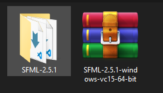

* Despues de extraerlo lo cortamos y pegamos en la carpeta del proyecto.

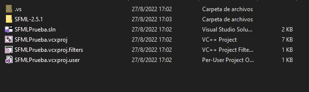

* Para realizar la configuracion en el proyecto ingresamos al Visual Studio 2022, abrimos el proyecto y nos dirigimos a sus propiedades.

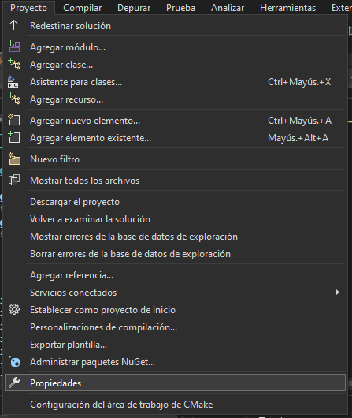

* Una vez entremos a propiedades nos apareceda la siguiente ventana en la cual escogemos la opcion de "Todas las config."

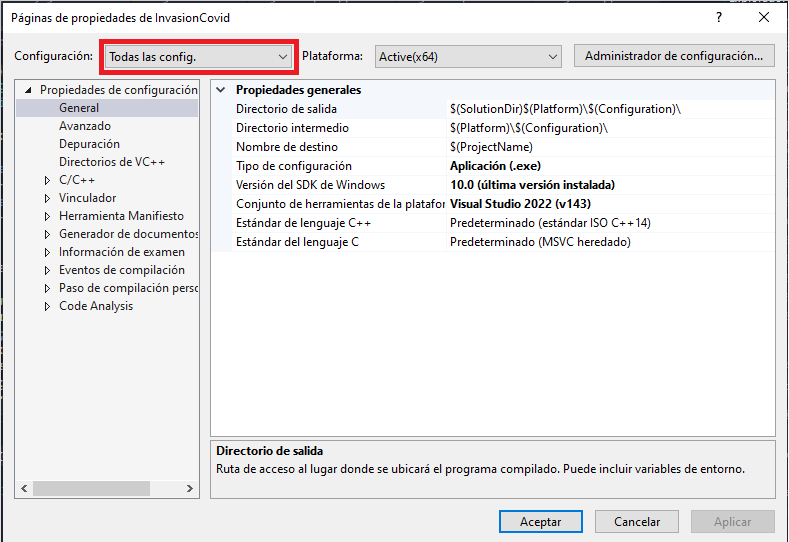

* Despues nos dirigimos a C/C++, despues a general y en "Directorios de inclusión adicionales" ingresamos la direccion de la carpeta **Include**, esta
se encuentra dentro de la carpeta SFML(esta fue copiada en la misma carpeta del proyecto en pasos anteriores).

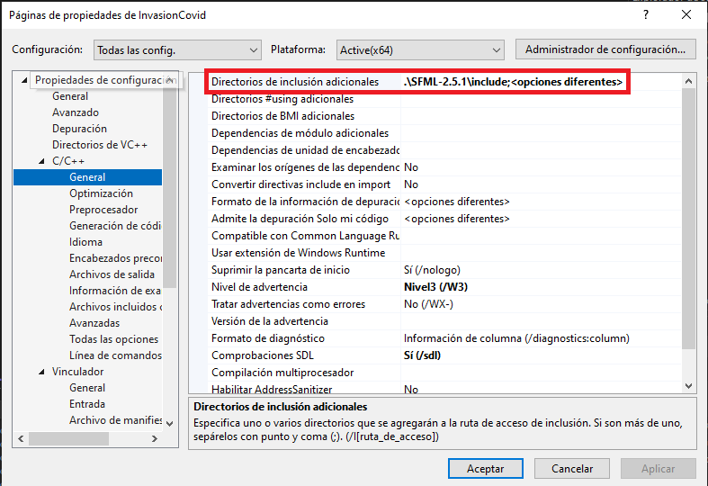

* Despues nos dirigimos a vinculador, despues a general y en "Directorios de bibliotecas adicionales" ingresamos la direccion de la carpeta **Lib**, esta
se encuentra dentro de la carpeta SFML(esta fue copiada en la misma carpeta del proyecto en pasos anteriores).

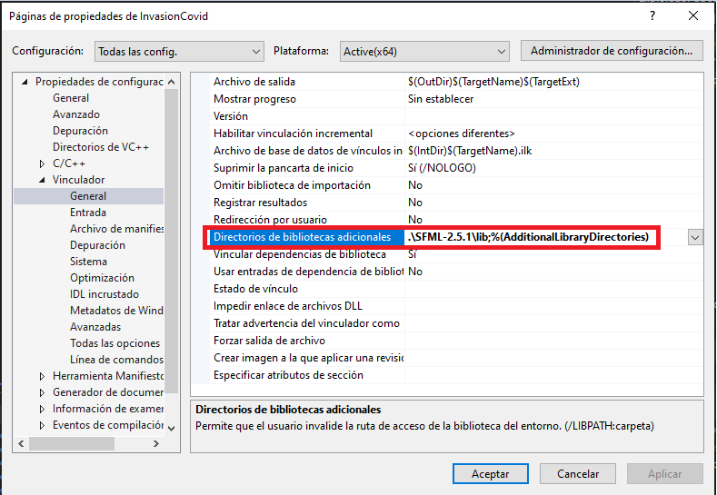

* Despues cambiamos la configuracion a **Release** y en Vinculador/Entrada/ en Dependencias Adicionales ingresamos los siguiente parametros: 
- sfml-graphics.lib
- sfml-window.lib
- sfml-audio.lib
- sfml-system.lib

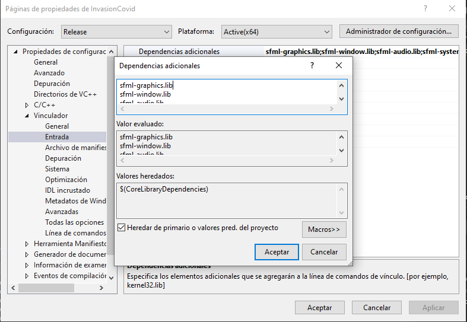

* Despues cambiamos la configuracion a **Debug** y en Vinculador/Entrada/ en Dependencias Adicionales ingresamos los siguiente parametros: 
- sfml-graphics-d.lib
- sfml-window-d.lib
- sfml-audio-d.lib
- sfml-system-d.lib

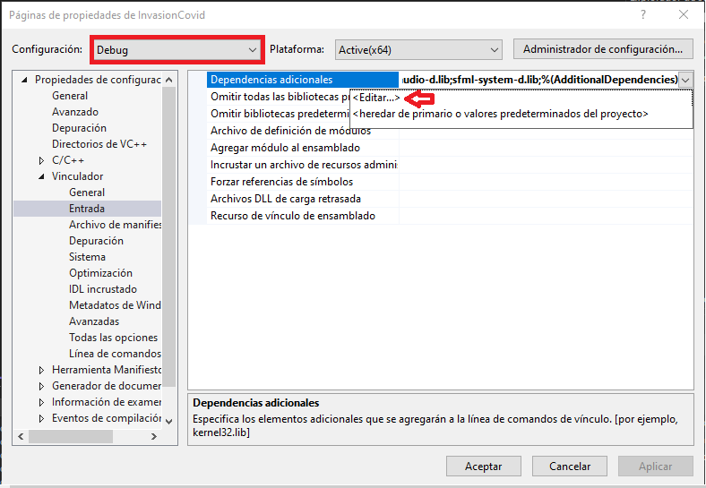

* Por ultimo copiamos los siguiente archivos de la carpeta : .\SFML-2.5.1\bin

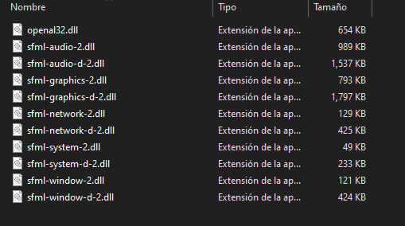

* Y los pegamos en la carpeta principal del proyecto

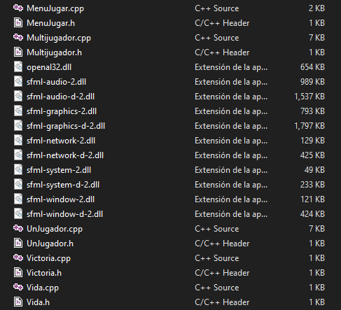

* Eso es todo ahora a disfrutar de SFML 👍.

## PRUEBAS SFML🔩
```C++
#include <SFML/Graphics.hpp>

int main()
{
    sf::RenderWindow window(sf::VideoMode(200, 200), "SFML works!");
    sf::CircleShape shape(100.f);
    shape.setFillColor(sf::Color::Green);

    while (window.isOpen())
    {
        sf::Event event;
        while (window.pollEvent(event))
        {
            if (event.type == sf::Event::Closed)
                window.close();
        }

        window.clear();
        window.draw(shape);
        window.display();
    }

    return 0;
}
```
[](https://postimg.cc/pm0cpSfT)

## DISEÑO DE SPRITES🎨: 
* Para el diseño de Algunos Sprites como en este caso los menus se utlizo el editor de gráficos vectoriales Adobe Illustrator.

   + ***Adobe illustration Controles***
     [](https://postimg.cc/HcBPys8f)
   + **Adobe Illustration Creditos**
     [](https://postimg.cc/hhv2Yndt)
* **Y para dar los ultimos retoques se utilizo adobe Photoshop. Es una herramienta ampliamente reconocida por su uso en la creación y edición de imágenes como gráficos.**
[](https://postimg.cc/R3vRLxm9)
   
## MANUAL DE INSTALACIÓN DEL PPROYECTO
* ***DESCARGAR VISUAL STUDIO(Si tienes VISUAL STUDIO saltar este paso)***
  + Enlace de descarga: https://visualstudio.microsoft.com/es/vs/community/
  + Una vez instalado, asegurarse haber instalado “Desarrollo para el escritorio con C++”
  
    [](https://postimg.cc/648JH4b6)

    [](https://postimg.cc/yWcTR880)

* ***DESCARGAR PROYECTO***
  + Ingresamos al enlace: https://github.com/pquispemor/EPCC_CCII_Proyecto
  + Descargamos el proyecto:
  
    [](https://postimg.cc/gn5RB9jG)
    
  + Una vez descargado

    [](https://postimg.cc/fkq0J4xY)
    
  + Descomprimir 

    [](https://postimg.cc/zb68YkgH)
    
    [](https://postimg.cc/Q99ZmWy8)
 
 * ***EJECUTAR PROYECTO***
   + Abrimos VISUAL STUDIO
   + Una vez abierto le damos en 
   
     [](https://postimg.cc/bZB6TFcn)
     
   + Buscamos la ruta del archivo que anteriormente descomprimido 
   
     [](https://postimg.cc/mz8VPdwh)
     
   + Entramos en el archivo
   
     [](https://postimg.cc/8JKBp7p6)
     
   + Le damos a InvasionCovid
   
     [](https://postimg.cc/87QdzQSt)
     
   + Le damos al archivo de nombre “InvasionCovid.sln” y empezara a abrir el proyecto
   
     [](https://postimg.cc/phTz6PfX)
     
   + Le damos en 
   
     [](https://postimg.cc/1n2n7wRJ)
     
   + Y finalmente se ejecutara el proyecto
   
     [](https://postimg.cc/F10HX2T9)
     
   + PDT: Estos son los controles principales del proyecto para moverse en el menú (W,A,S,D) y para ingresar (Espacio).
   
     [](https://postimg.cc/LgmKp0sX)
     

## CAPTURAS📷
* **Inicio**

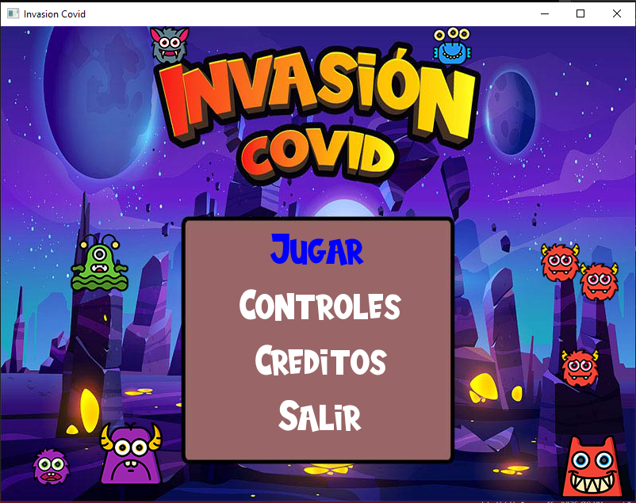

* **Controles**

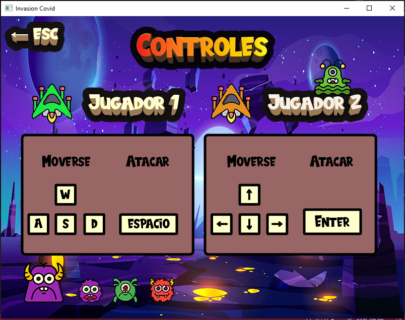

* **Creditos**

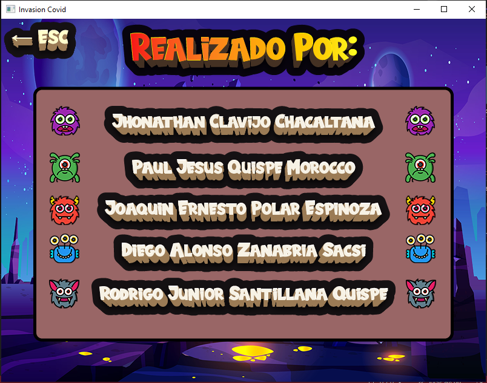

* **Selección de jugador**

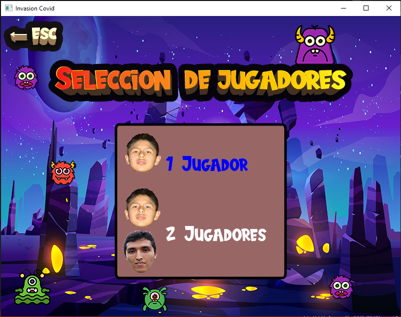

* **Juego en ejecución - UN JUGADOR**

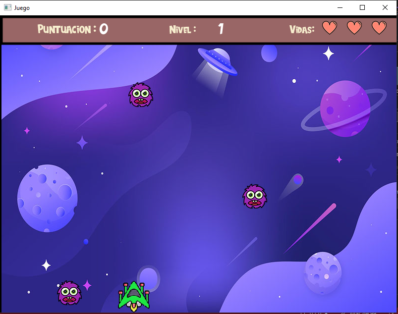

* **Juego en ejecución - 2 JUGADORES**

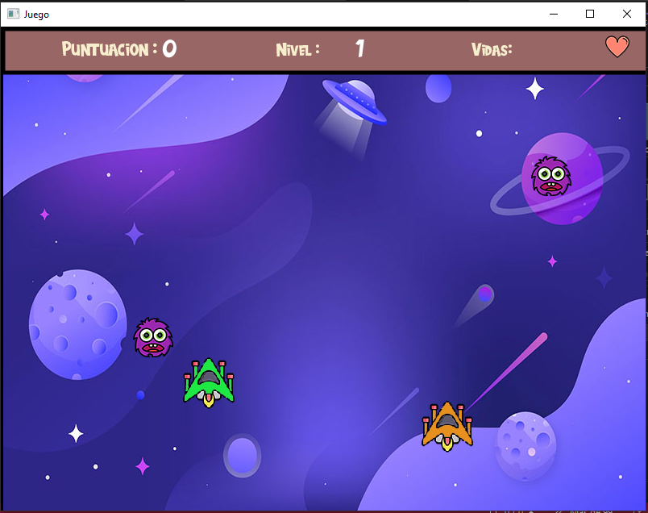

* **Juego en ejecución - Cambio de Nivel**

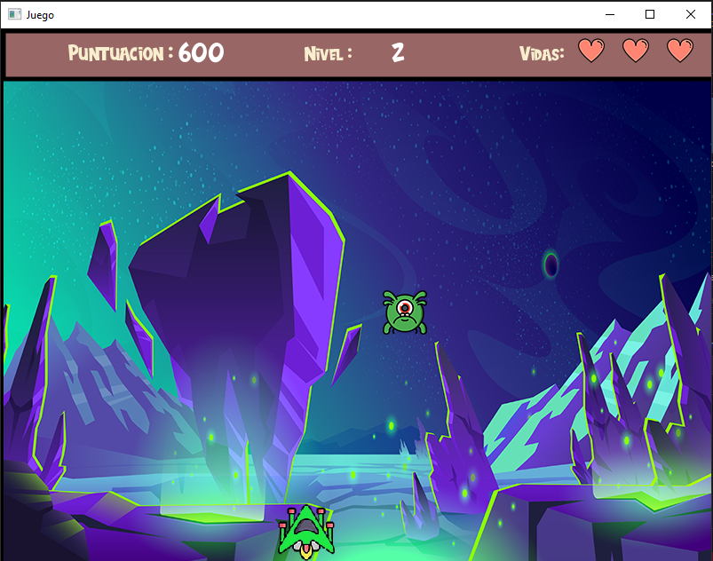

* **Victoria**

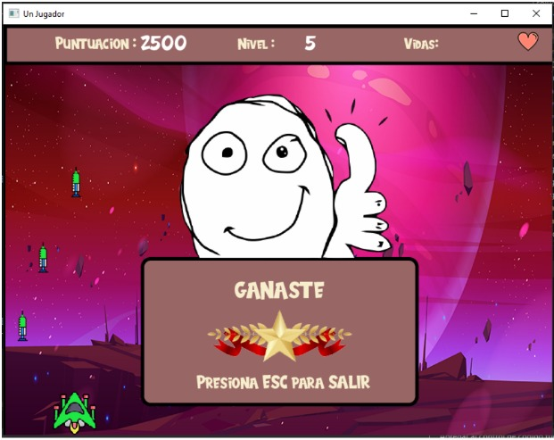

* **Derrota**

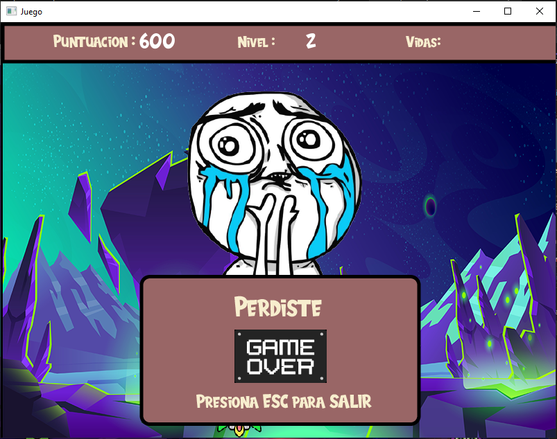


## Clases
  + 1. Main
  + 2. MainMenu
  + 3. MainMenuExtras
  + 4. Menu
  + 5. MenuFactory
  + 6. Menu Jugar
  + 7. Menu Controles
  + 8. Menu Creditos
  + 9. Un jugador
  + 10. Multijugador
  + 11. Juego Principal
  + 12. Jugador Main
  + 13. Jugador 1
  + 14. Jugador 2
  + 15. Vida
  + 16. Enemigo
  + 17. Derrota
  + 18. Bala
  + 19. Victoria
## DIAGRAMA DE CODIGO


## Video de Instalacion y Ejecucion de Software

[](https://www.youtube.com/watch?v=tyK1FN5ZSnY)

https://www.youtube.com/watch?v=tyK1FN5ZSnY

## Video Exposicion del software

[https://www.youtube.com/watch?v=tyK1FN5ZSnY](https://www.youtube.com/watch?v=uIG27MHUU3s)
